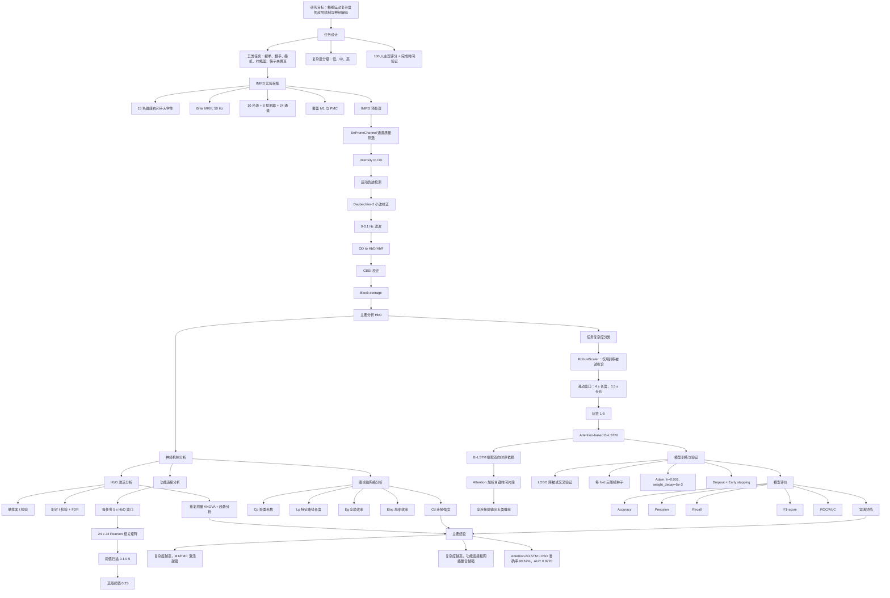
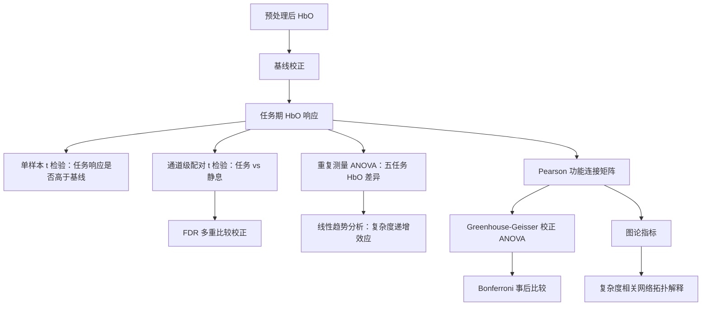

# 方法流程图

## 总体研究流程

```mermaid
flowchart TD
    A["研究目标：精细运动复杂度的皮层机制与神经解码"] --> B["任务设计"]
    B --> B1["五类任务：握拳、翻手、撕纸、拧瓶盖、筷子夹黄豆"]
    B --> B2["复杂度分级：低、中、高"]
    B --> B3["100 人主观评分 + 完成时间验证"]

    B1 --> C["fNIRS 实验采集"]
    C --> C1["15 名健康右利手大学生"]
    C --> C2["Brite MKIII, 50 Hz"]
    C --> C3["10 光源 + 8 探测器 + 24 通道"]
    C --> C4["覆盖 M1 与 PMC"]

    C --> D["fNIRS 预处理"]
    D --> D1["EnPruneChannel 通道质量筛选"]
    D1 --> D2["Intensity to OD"]
    D2 --> D3["运动伪迹检测"]
    D3 --> D4["Daubechies-2 小波校正"]
    D4 --> D5["0-0.1 Hz 滤波"]
    D5 --> D6["OD to HbO/HbR"]
    D6 --> D7["CBSI 校正"]
    D7 --> D8["Block average"]
    D8 --> D9["主要分析 HbO"]

    D9 --> E["神经机制分析"]
    E --> E1["HbO 激活分析"]
    E --> E2["功能连接分析"]
    E --> E3["图论脑网络分析"]

    E1 --> F1["单样本 t 检验"]
    E1 --> F2["配对 t 检验 + FDR"]
    E1 --> F3["重复测量 ANOVA + 趋势分析"]

    E2 --> G1["每任务 5 s HbO 窗口"]
    G1 --> G2["24 x 24 Pearson 相关矩阵"]
    G2 --> G3["阈值扫描 0.1-0.5"]
    G3 --> G4["选取阈值 0.25"]

    E3 --> H1["Cp 聚类系数"]
    E3 --> H2["Lp 特征路径长度"]
    E3 --> H3["Eg 全局效率"]
    E3 --> H4["Eloc 局部效率"]
    E3 --> H5["Cd 连接强度"]

    D9 --> I["任务复杂度分类"]
    I --> I1["RobustScaler：仅用训练被试拟合"]
    I1 --> I2["滑动窗口：4 s 长度，0.5 s 步长"]
    I2 --> I3["标签 1-5"]
    I3 --> J["Attention-based Bi-LSTM"]
    J --> J1["Bi-LSTM 提取双向时序依赖"]
    J1 --> J2["Attention 加权关键时间片段"]
    J2 --> J3["全连接层输出五类概率"]

    J --> K["模型训练与验证"]
    K --> K1["LOSO 跨被试交叉验证"]
    K --> K2["每 fold 三随机种子"]
    K --> K3["Adam, lr=0.001, weight_decay=5e-3"]
    K --> K4["Dropout + Early stopping"]

    K --> L["模型评价"]
    L --> L1["Accuracy"]
    L --> L2["Precision"]
    L --> L3["Recall"]
    L --> L4["F1-score"]
    L --> L5["ROC/AUC"]
    L --> L6["混淆矩阵"]

    F3 --> M["主要结论"]
    H5 --> M
    L6 --> M
    M --> M1["复杂度越高，M1/PMC 激活越强"]
    M --> M2["复杂度越高，功能连接和网络整合越强"]
    M --> M3["Attention-BiLSTM LOSO 准确率 90.67%，AUC 0.9720"]
```

## 模型流程

```mermaid
flowchart LR
    A["连续 HbO 多通道时间序列"] --> B["LOSO fold 划分"]
    B --> C["训练被试拟合 RobustScaler"]
    C --> D["训练集与测试被试标准化"]
    D --> E["滑动窗口切片：200 点，步长 25 点"]
    E --> F["窗口样本 X：time x channels"]
    F --> G["Bi-LSTM"]
    G --> H["Hidden states"]
    H --> I["Temporal attention"]
    I --> J["Context vector"]
    J --> K["Fully connected layer"]
    K --> L["Softmax class probability"]
    L --> M["五类精细运动任务"]
```

## 统计分析流程

```mermaid
flowchart TD
    A["预处理后 HbO"] --> B["基线校正"]
    B --> C["任务期 HbO 响应"]
    C --> D["单样本 t 检验：任务响应是否高于基线"]
    C --> E["通道级配对 t 检验：任务 vs 静息"]
    E --> F["FDR 多重比较校正"]
    C --> G["重复测量 ANOVA：五任务 HbO 差异"]
    G --> H["线性趋势分析：复杂度递增效应"]
    C --> I["Pearson 功能连接矩阵"]
    I --> J["Greenhouse-Geisser 校正 ANOVA"]
    J --> K["Bonferroni 事后比较"]
    I --> L["图论指标"]
    L --> M["复杂度相关网络拓扑解释"]
```

